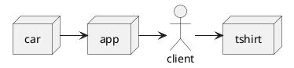

# car-production-corp
Really nice car productions

### HowTo

__Bitte zuerst__ `IntelliJ` und git installieren.

### Business-Case

```plantuml
@startuml
actor client
node app
node car
node tshirt

car -> app
app -> client
client -> tshirt
@enduml
```

